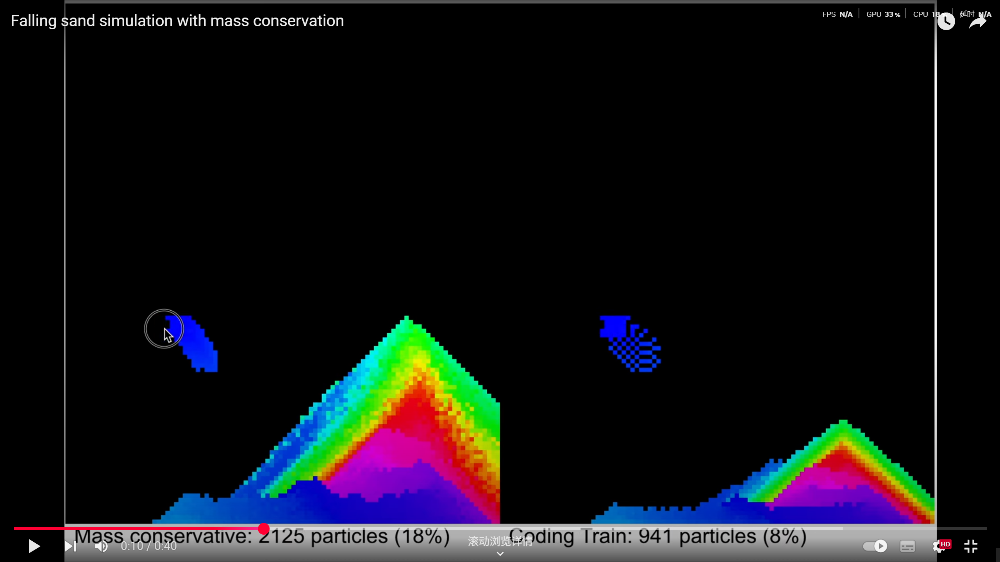

Quiz8

### part1

### This is an animation code for quicksand. Rainbow-colored falling sand can generate a multivariate background, and I want to use this code to accomplish a multivariate transformation of the background.

### part2
[coding link](https://github.com/alin256/falling_sand_fixed)

### The source code for the animation of the quicksand is directly available on the web, above is a link to the quicksand, and I think I'm going to modify the colors in the code, gradient them, and make some changes to the original background of our group, and even to the apple tree itself.
### Based on the above effect, we can make the observer see a different picture background each time.